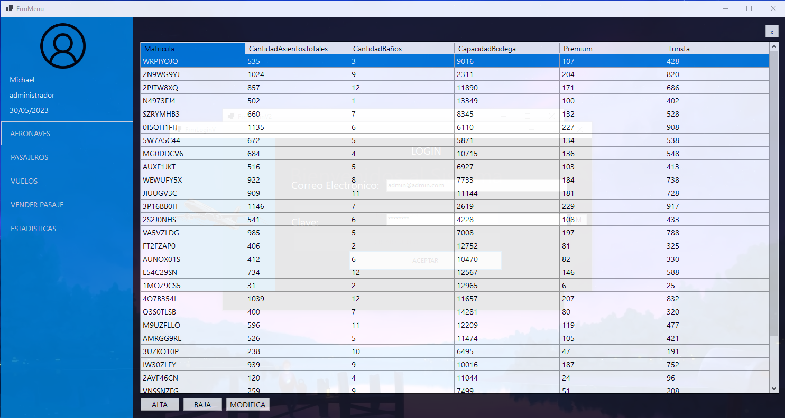

# MEG AEROLINEA
Mi nombre es Yober Marlow, estudiante de la Tecnicatura en 
Programacion de la UTN. Tuve mucha difultad al principio 
sinceramente, pero con el tiempo fui agarrandole la mano, pienso que
tuve esta dificultad porque no tenia mucha practica al comienzo, pero 
de a poco fui haciendo las cosas. Es muy satisfactorio ver el trabajo
terminado asi que si me diverti en algunos momentos.

# FORMULARIO DE BIENVENIDA

Formulario de Bienvenida en el cual puedo elegir si iniciar sesion o crearme alguna cuenta.

# FORMULARIO CREAR CUENTA

Me pedi los datos y estos se guardan dentro de mi archivo de usuarios llamado MOCK_DATA.json

# FORMULARIO INICIO SESION

Me pedi mis datos para poder iniciar sesion al programa, luego de inciar sesion dependiendo del usuario tengo invalido algunos botones del formulario Menu, ya que cada usuario tiene distintas tareas, tambien cada vez que alguien se loguea se guarda en un archivo usuarios.log quien entro y la fecha con horario.Tambien le añadi un boton que me permita mostrar o ocultar la contraseña.

# FORMULARIO MENU

En este formulario tengo distintos botones que me van a permitir acceder a mis formularios de Aeronaves,Pasajeros,Vuelos,Vender Pasaje y Estadisticas.

# FORMULARIO AERONAVES

Dentro del formulario tengo un datagridview con los datos del avion, tambien puedo crear,eliminar y modificar aeronaves,todas acciones se van serializando en el archivo Aeronaves.json

# FORMULARIO PASAJEROS

Dentro del formulario tengo un datagridview con los datos del pasajero, tambien puedo crear,eliminar y modificar pasajeros,todas acciones se van serializando en el archivo Pasajeros.json

# FORMULARIO VUELOS

Dentro del formulario tengo un datagridview con los datos del vuelo, tambien puedo crear,eliminar y modificar vuelos,todas acciones se van serializando en el archivo Vuelos.json

# FORMULARIO VENDER PASAJE

Dentro del formulario, me permite seleccionar un pasajero y luego un vuelo, permitiendome elegir si es premium o no, si lleva equipaje de mano o no y dependiendo de la eleccion de que si es turista o Premium me habilida poner el kg de una valija o dos valijas.
Tambien me permite buscar los clientes o vuelos.

# FORMULARIO ESTADISTICAS

Me muestra las estadisticas de los vuelos, tales como el destino mas elegido, las ganacias totales, las ganancias naciones e internacionales,los destinos facturados y las horas de las aeronaves.

# RESUMEN

La aplicacion es un sistema de ventas para una Aerolinea, permitiendo el inicio de sesion
del usuario, dependiendo del mismo cada usuario tiene diferentes tareas.Las
tareas hay son las de crear, modificar y eliminar Aeronaves,Pasajeros y vuelos;
todos estos de un archivo xml o json.

# DIAGRAMA

# JUSTIFICACIÓN TÉCNICA

- Introducción a .NET y C#
- Clases y métodos estáticos:
    - Clase Estatica Archivos: dentro de esta clase voy a guardar mis datos tanto como mi lista de Aeronaves,Pasajeros,Vuelos y etc, los cuales van a ser deserializados por unica vez cuando inicie el programa.Seria mi base de datos.
    - Clase Estatica Compañia: sirve de capa para acceder a mis listas sin la necesidad de usarlos directamente.

- Clases y metodos no estaticos:
    - Clase Persona = clase abstracta padre para mis clases Pasajero y Usuario,con sus atributos y constructores.
    - Clases Usuario:Persona y Pasajero:Persona = clases hijas que de Persona, las cuales comparten atributos en comun como nombre, apellido, edad y dni,con sus atributos y constructores.
    - Clase Pasaje= representa un pasaje de un vuelo,con sus atributos y constructores.
    - Clase Aeronave= representa una aeronave, con sus atributos y constructores.
    - Clase Vuelo=representa la relacion entre Pasaje y Aeronave, sirve para crear nuestros vuelos, con sus atributos y constructores.
- SobreCarga: 
    - Todas mis clases poseen sobrecargas tanto en operadores y metodos, hacen que el programa sea mas fluido y no haya la necesidad de crear muchos metodos. Por ejemplo, en la clase Persona uso la sobrecarga de "==" para cuando cree un Pasajero me invalide crear a alguien con el mismo dni.
- WindowsForm: Utilizo distintos formularios para mi programa, los cuales cuentan con diversas herramientas y algunas que no vimos en clases, mis formularios son:FrmAeronave, FrmAltaAeronave,FrmModificarAeronave,FrmCrearCuenta,FrmLogin,FrmAltaPasajero,FrmModificarPasajero,FrmPasajero,FrmAltaVuelo,FrmModificarVuelo,FrmVuelo,FrmVentaPasaje,FrmBienvenida,FrmEstadisticas,FrmMenu.
- Colecciones:Utilizo listas y diccionarios para informar las estadisticas.
- Archivos,Serilizacion y Deserilizacion en JSON y XML: Uso esto en mi clase Archivos para deserializar mis archivos que contienen dentro la lista de datos y serializo cada vez que doy un alta, modifico o elimino algo para que el archivo se modifique cada vez que hago estas acciones.
- Herencia: Aplico la herencia con mis clase Persona que actua como mi clase padre de mis clases Pasajero y Usuario.
- Polimorfismo y clases abstractas: mi clase Persona trabaja como abstracta y uso polimorfismo en todas las clases no static, sobrescribiendo ToString, Equals y GetHashCode.

Esto abarcaria los 9 temas que vimos, tambien inclui expeciones para las validaciones de datos.

Todos mi archivos JSON, XML y el usuario.log se guardan en bin de mi carpeta de formularios.

# PROPUESTA DE VALOR AGREGADO

Agregue la opcion de poder crear una cuenta, pidiendome los datos de la persona que quiera ser usuario.

